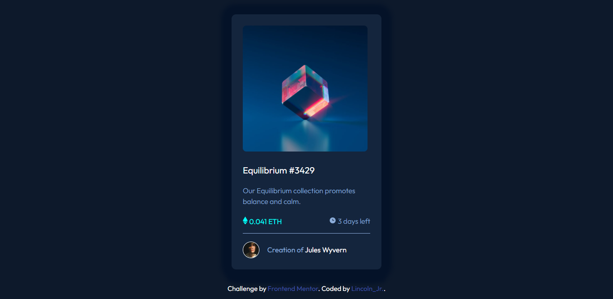

# Frontend Mentor - NFT preview card component 

This is a solution to the [NFT preview card component challenge on Frontend Mentor](https://www.frontendmentor.io/challenges/nft-preview-card-component-SbdUL_w0U). Frontend Mentor challenges help you improve your coding skills by building realistic projects. 

## Table of contents

- [Overview](#overview)
  - [The challenge](#the-challenge)
  - [Screenshot](#screenshot)
  - [Links](#links)
- [My process](#my-process)
  - [Built with](#built-with)

  
- [Author](#author)
- [Acknowledgments](#acknowledgments)

## Overview

### The challenge
Users should be able to:

- View the optimal layout depending on their device's screen size
- See hover states for interactive elements

### Screenshot

### Links

- Solution URL: [https://www.frontendmentor.io/solutions/responsive-nftpreview-card-component-IJ-EdzLkaK](https://www.frontendmentor.io/solutions/responsive-nftpreview-card-component-IJ-EdzLkaK)
- Live Site URL: [https://lincolnez.github.io/NFT_Preview_Card/](https://lincolnez.github.io/NFT_Preview_Card/)

## My process

### Built with

- Semantic HTML5 markup
- CSS custom properties
- Flexbox
- CSS Grid
- Mobile-first workflow
- Sass

## Author

 Frontend Mentor - [@lincolnez](https://www.frontendmentor.io/profile/lincolnez)

## Acknowledgments
 inspiration from jessica chan - https://www.freecodecamp.org/news/author/thecodercoder/

The NFTpreview card component is built 